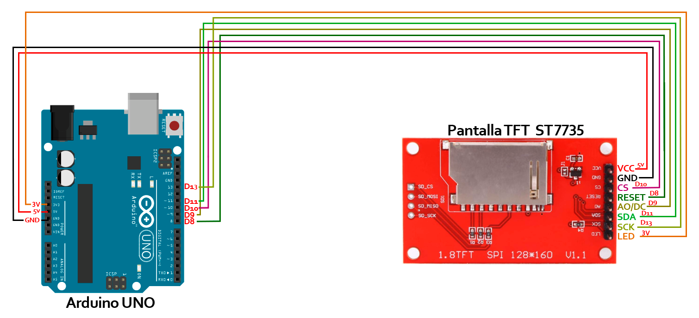
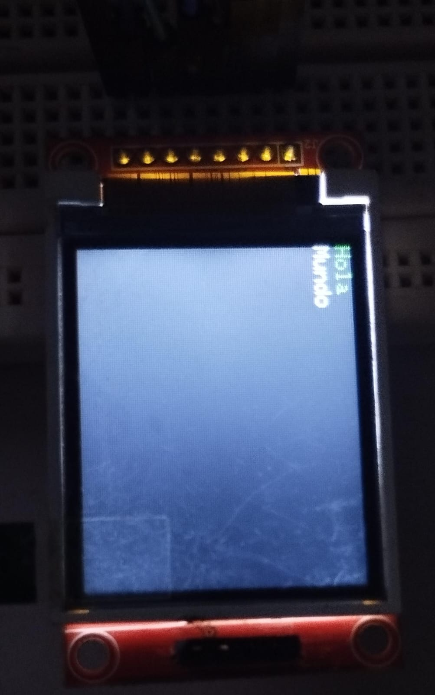

# Escribir en pantalla TFT-ST7735
Indicaciones de cómo conectar y escribir la pantalla TFT ST7735.

## Arduino UNO:
<div align="center">
      
</div>

<br>

### Código:

```c++
// Importar las librerías necesarias para manejar la pantalla TFT y la comunicación SPI
#include <TFT.h>  // Pantalla TFT
#include <SPI.h>  // Pantalla TFT

// Definir los pines de la pantalla para el Arduino Uno
#define cs   10    // Chip select (selección de chip)
#define dc   9     // Data/Command (datos/comando)
#define rst  8     // Reset (reinicio)

// Crear un objeto de la clase TFT con los pines definidos
TFT pantalla = TFT(cs, dc, rst);

void setup() {
  // Inicializar la comunicación serie a 9600 baudios
  Serial.begin(9600);

  // Inicializar la pantalla
  pantalla.begin();  
  
  // Rotar la pantalla 270 grados (3 es el valor correspondiente para esta rotación)
  pantalla.setRotation(3);
  
  // Limpiar la pantalla con un fondo negro
  pantalla.background(0, 0, 0);

  // Configurar el color del texto a verde y escribir un texto estático en la pantalla
  pantalla.stroke(0, 255, 0); // Color del texto: verde
  pantalla.setTextSize(1.5);  // Establecer el tamaño del texto
  pantalla.text("Hola", 0, 0);  // Escribir el texto en la esquina superior izquierda

  // Cambiar el color del texto a blanco y escribir otro texto estático en la pantalla
  pantalla.stroke(255, 255, 255); // Color del texto: blanco
  pantalla.setTextSize(1.2);  // Establecer un tamaño de texto más pequeño
  pantalla.text("Mundo", 0, 10);  // Escribir el texto debajo del anterior, con un desplazamiento en Y
}

void loop() {
}
```
<br>

### Resultado:
<div align="center">
      
</div>
